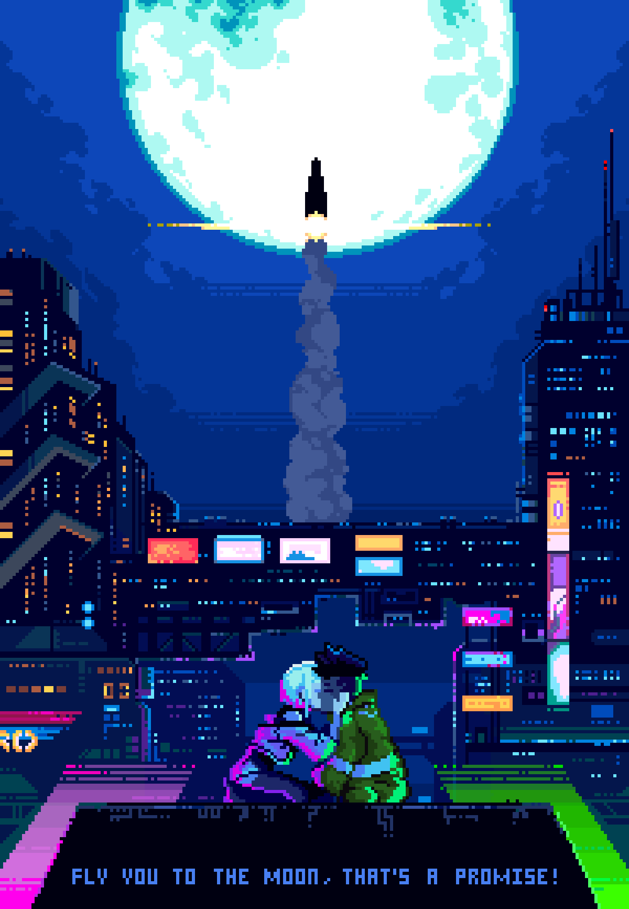

                        

<h2 align="center">📋&ensp; <i>Ｓｏｂｒｅ</i> &ensp;📋</h2>

<ul align="left">
    <li>🤩️ Amante de Tecnologia, Jogos, Café e Esportes 🤩️</li> 
    <li>🚀 Em processo de transição de carreira, sempre buscando conhecimento para poder avançar e me destacar no mercado de trabalho e assim alcançar minha tão sonhada primeira vaga como dev front-end 🚀</li> 
    <li>💻 Estudo na Faculdade <a href="https://www.uninassau.edu.br/?utm_source=google&utm_medium=maps&utm_campaign=icherry-UNI072" target="_blank">UNINASSAU</a> e buscando complementar meus conhecimentos através da plataforma de estudos <a href="https://www.rocketseat.com.br/" target="_blank">Rocketseat</a> e <a href="https://www.freecodecamp.org/" target="_blank">freeCodeCamp</a>. Estou praticando <b>JavaScript</b> e <b>React</b> na Rocketseat 💻</li> 
    <li>🔮Meu objetivo num futuro próximo, é me tornar desenvolvedor Front-End Web🔮</li> 
</ul>
 

<h2 align="center">🛠️&ensp; <i>Ｔｅｃｎｏｌｏｇｉａ</i> &ensp;🛠️</h2>

<table align="right" height="300px">
  <tr>
    <td align="center">
       
      
        <b>
          <pre>VSCode</pre>
        </b>
      
    </td>
    <td align="center">
       
      
        <b>
          <pre>HTML</pre>
        </b>
      
    </td>
    <td align="center">
       
      
        <b>
          <pre>&ensp;CSS&ensp;</pre>
        </b>
      
    </td>
    <td align="center">
       
      
        <b>
          <pre>JavaScript</pre>
        </b>
      
    </td>
    <!--
    <td align="center">
       
      
        <b>
          <pre>React</pre>
        </b>
      
    </td>-->
  </tr>
  <tr>
  <!--
    <td align="center">
       
      
        <b>
          <pre>Vite</pre>
        </b>
      
    </td>-->
    <td align="center" width="100px;">
       
      
        <b>
          <pre>&emsp;GitHub&emsp;</pre>
        </b>
      
    </td>
    <td align="center" width="100px;">
       
      
        <b>
          <pre>&emsp;Git&emsp;</pre>
        </b>
      
    </td>
    <td align="center">
       
      
        <b>
          <pre>Figma</pre>
        </b>
      
    </td>
    <td align="center">
       
      
        <b>
          <pre>Markdown</pre>
        </b>
      
    </td>
  </tr>
<!--<td align="center">
       
      
        <b>
          <pre>Yarn/npm</pre>
        </b>
      
    </td>
  </tr>
  <tr>
    <td align="center">
       
      
        <b>
          <pre>TypeScript</pre>
        </b>
      
    </td>
    <td align="center">
       
      
        <b>
          <pre>Tailwind</pre>
        </b>
      
    </td>
    <td align="center">
       
      
        <b>
          <pre>NodeJS</pre>
        </b>
      
    </td>
    <td align="center">
       
      
        <b>
          <pre>Terminal</pre>
        </b>
      
    </td>
  </tr>-->
</table> 
               

<h2 align="center">💬&ensp; <i>Ｃｏｎｔａｔｏ</i> &ensp;💬</h2>

  

  
   
   
  
  
  

   

<h2 align="center">👨🏻‍💻&ensp; <i>Ｐｒｏｊｅｔｏｓ</i> &ensp;👨🏻‍💻</h2>

<table height="495px" width="365px">
  <tr>
    <td>
    
    </td>
  </tr>
</table>
 

<h2 align="center">

📈&ensp; <i>Ａｔｉｖｉｄａｄｅ</i> &ensp;📈

 

  

  <a href="https://github.com/danielfeitosa4">
  
  

 
 
 
 

  
 

 

